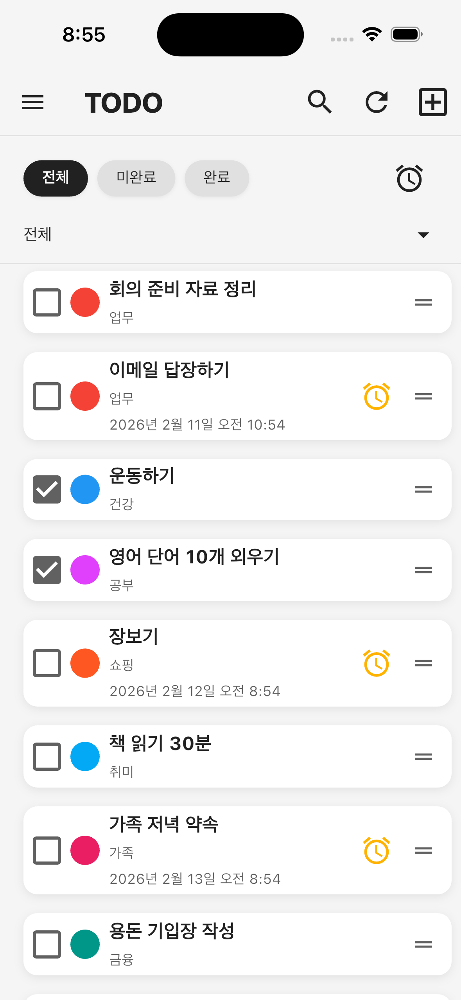
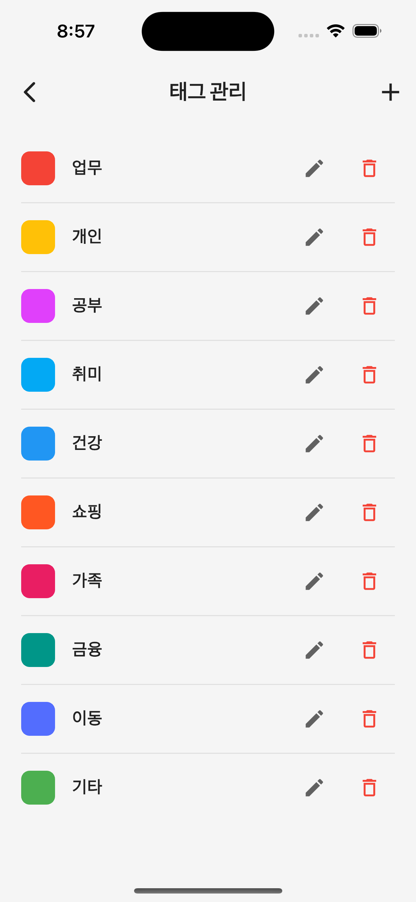
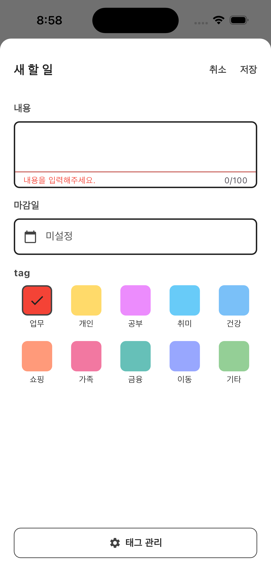
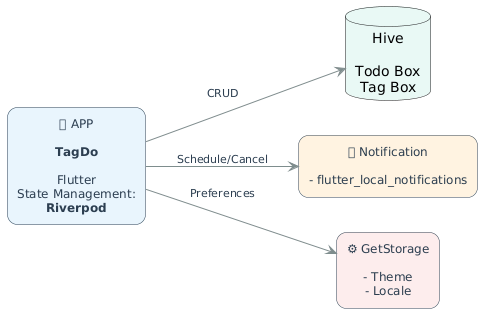
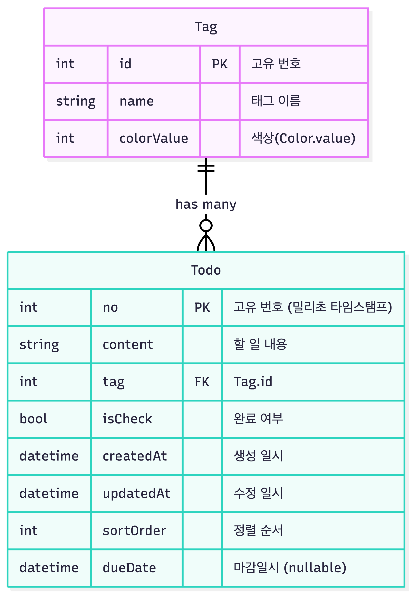

# TagDo

태그 기반 할 일 앱. 태그 분류, 마감일·알림, 검색, 드래그 정렬을 지원한다.

### 대표 이미지

| 메인 화면 | 태그 관리 | 새 할 일 |
|:---------:|:---------:|:---------:|
|  |  |  |

---

## 주요 기능

| 기능 | 설명 |
|------|------|
| 태그 | 업무/개인/공부 등 10종 기본 태그, 색상·이름 커스터마이징 |
| 필터 | 전체/미완료/완료, 태그별, 마감일 유무 |
| 마감일·알림 | 로컬 알림 예약, 앱 재시작 시 알람 재등록 |
| 검색 | 할 일 내용 실시간 검색 |
| 순서 변경 | 드래그 앤 드롭으로 리스트 정렬 |
| 테마 | 라이트/다크/시스템, 영속화 |
| 다국어 | ko, en, ja, zh-CN, zh-TW |

---

## 기술 스택

| 구분 | 기술 | 용도 |
|------|------|------|
| 상태 관리 | Riverpod | 비동기 데이터, 테마, 필터 상태 |
| 로컬 DB | Hive | Todo·Tag 영속화, NoSQL Key-Value |
| 설정 | GetStorage | 테마·언어 등 경량 설정 |
| 다국어 | easy_localization | 5개 언어, locale 기반 |
| 알림 | flutter_local_notifications | 마감일 알람, 포그라운드 표시 |
| UI | Material + Custom ColorScheme | 플랫/미니멀 스타일, 테마 일관성, 시맨틱 컬러 |

---

## 사용 패키지

| 패키지 | 버전 | 용도 |
|--------|------|------|
| **상태·UI** | | |
| flutter_riverpod | ^3.2.0 | 상태 관리 (Todo, 테마, 필터) |
| flutter_colorpicker | ^1.1.0 | 태그 색상 선택 (MaterialPicker) |
| **로컬 저장소** | | |
| hive / hive_flutter | ^2.2.3 / ^1.1.0 | Todo·Tag DB (NoSQL) |
| get_storage | ^2.1.1 | 경량 설정 (테마, 튜토리얼, wakelock 등) |
| **알림·배지** | | |
| flutter_local_notifications | ^20.1.0 | 마감일 로컬 알람 |
| timezone | ^0.10.0 | 알람 타임존 처리 |
| app_badge_plus | ^1.2.6 | 앱 아이콘 배지 (예약 알람 개수) |
| **다국어** | | |
| easy_localization | ^3.0.8 | 5개 언어 (ko, en, ja, zh-CN, zh-TW) |
| intl | ^0.20.2 | 날짜 포맷 |
| **기타** | | |
| permission_handler | ^12.0.1 | 알림 등 권한 요청 |
| showcaseview | ^5.0.1 | 튜토리얼/온보딩 스포트라이트 |
| in_app_review | ^2.0.11 | 스토어 평점 요청 팝업 |
| wakelock_plus | ^1.4.0 | 화면 꺼짐 방지 |
| flutter_native_splash | ^2.4.7 | 앱 시작 스플래시 |
| http | ^1.1.0 | HTTP 클라이언트 (NetworkUtil 등) |

<details>
<summary>dev_dependencies</summary>

| 패키지 | 용도 |
|--------|------|
| flutter_lints | 린트 규칙 |
| flutter_launcher_icons | 앱 아이콘 생성 |

</details>

---

## 아키텍처

**MVVM + 레이어 분리**

```
lib/
├── model/      # Todo, Tag, Hive TypeAdapter
├── view/       # UI 전담 (home, app_drawer, sheets, todo_item)
├── vm/         # 비즈니스 로직·상태
│   ├── *Handler   → DB/저장소 접근 (DatabaseHandler, TagHandler)
│   └── *Notifier  → Riverpod 상태 (TodoListNotifier, ThemeNotifier 등)
├── service/    # NotificationService (알림 예약·취소)
├── theme/      # ColorScheme, palette, ConfigUI
└── util/       # 공통 유틸, locale

assets/
└── translations/   # 다국어 JSON (ko, en, ja, zh-CN, zh-TW)
```

- **View**: UI 렌더링만. `ref.watch`로 상태 구독, `ref.read`로 액션 호출
- **Handler**: Hive Box CRUD 전담. Repository 용어 대신 Handler 사용 (Git 혼동 방지)
- **Notifier**: Riverpod AsyncNotifier/Notifier. `ref.invalidateSelf()`로 재로딩
- **테마**: `CommonColorScheme` + `context.palette`로 라이트/다크 색상 통일
- **다국어**: `easy_localization` + `assets/translations/`. JSON 형태로 각 언어별 관리 (ko, en, ja, zh-CN, zh-TW). Drawer에서 언어 선택

### 시스템 구성도



### 데이터 모델 (ERD)



---

## 실행

```bash
flutter pub get
flutter run
```
